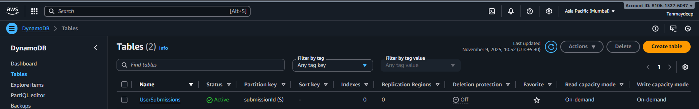
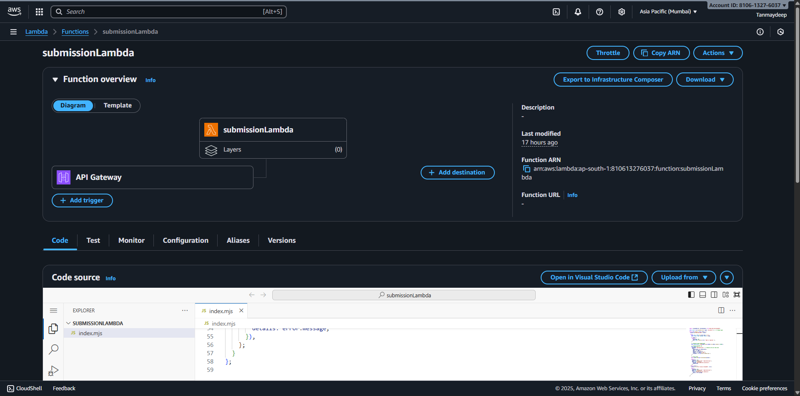
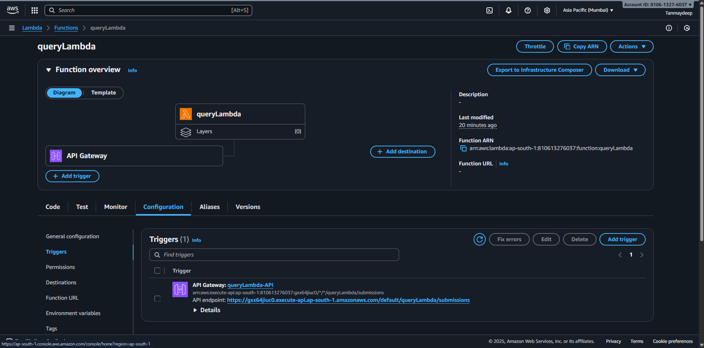
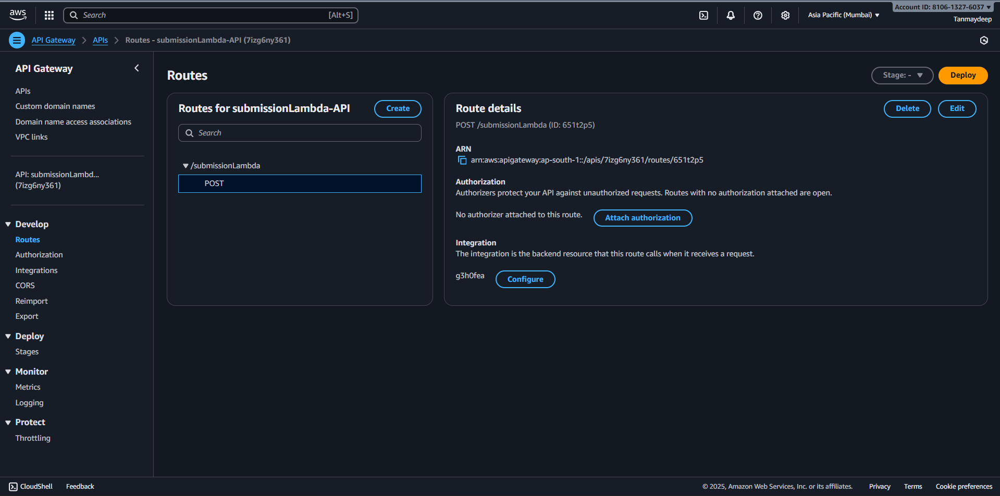
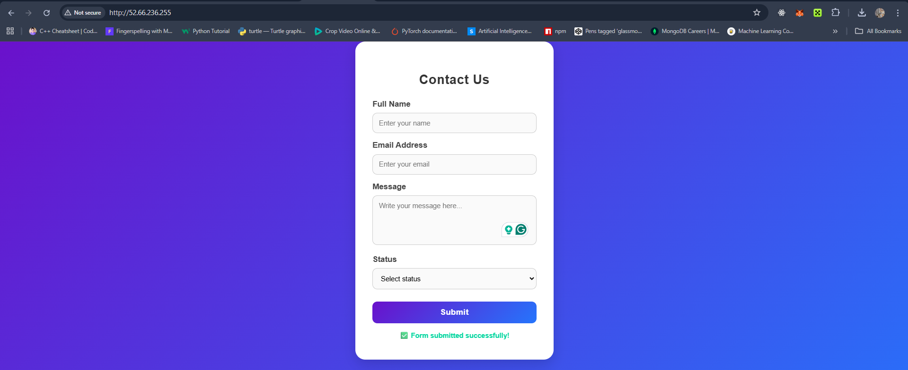
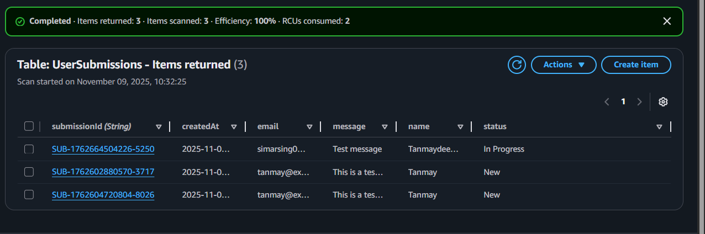

# 🌐 Web Form with DynamoDB, EC2, API Gateway, and Lambda

## 🧾 Project Overview

This project demonstrates a **serverless web application** that performs CRUD operations on user data submitted through an HTML form hosted on **Amazon EC2**. The submitted data is processed via **AWS Lambda functions**, exposed through **API Gateway**, and stored in **DynamoDB**.

---

## 🏗️ Architecture Components

| Component | Description |
|------------|--------------|
| **EC2 Instance** | Hosts a static HTML form (frontend) |
| **API Gateway** | Acts as the entry point for HTTP requests |
| **Lambda Functions** | Handle data processing and interaction with DynamoDB |
| **DynamoDB** | Stores the form submissions |
| **IAM Roles** | Manage secure permissions between AWS services |

---

## 📋 Detailed Requirements

### 1. DynamoDB Table Design

Create a table named **`UserSubmissions`** with the following schema:

| Attribute | Type | Description |
|------------|------|-------------|
| **submissionId** | String | Partition Key |
| **name** | String | User’s name |
| **email** | String | User’s email |
| **message** | String | User’s message |
| **submissionDate** | String | Date of submission |
| **status** | String | Submission status |

[](./Images/Screenshot1.png)

---

### 2. Lambda Functions

#### 📨 Submission Lambda

**Purpose:** Handles POST requests to add new submissions.

- Triggered by **API Gateway POST** request  
- Validates input data  
- Generates a unique `submissionId`  
- Stores record in DynamoDB  
- Returns a success or error response  

[](./Images/Screenshot2.png)  
[](./Images/Screenshot5.png)

```javascript
// Submission Lambda

import { DynamoDBClient, PutItemCommand } from "@aws-sdk/client-dynamodb";

const client = new DynamoDBClient({ region: "ap-south-1" }); // 🔹 Change region

export const handler = async (event) => {
  console.log("Received event:", event);

  try {
    const body = JSON.parse(event.body || "{}");
    const { email, name, message, status } = body;

    if (!email) {
      return {
        statusCode: 400,
        body: JSON.stringify({ error: "Email is required." }),
      };
    }

    // ✅ Generate unique submissionId
    const submissionId = `SUB-${Date.now()}-${Math.floor(Math.random() * 10000)}`;

    // ✅ Prepare DynamoDB item
    const params = {
      TableName: "UserSubmissions",
      Item: {
        submissionId: { S: submissionId },
        email: { S: email },
        name: { S: name || "" },
        message: { S: message || "" },
        status: { S: status || "New" },
        createdAt: { S: new Date().toISOString() },
      },
    };

    // ✅ Save record
    await client.send(new PutItemCommand(params));

    return {
      statusCode: 200,
      headers: { "Content-Type": "application/json" },
      body: JSON.stringify({
        message: "Form submitted successfully!",
        submissionId,
      }),
    };
  } catch (error) {
    console.error("Error saving to DynamoDB:", error);

    return {
      statusCode: 500,
      headers: { "Content-Type": "application/json" },
      body: JSON.stringify({
        error: "Failed to process submission.",
        details: error.message,
      }),
    };
  }
};
````

---

#### 🔍 Query Lambda

**Purpose:** Handles GET requests to retrieve submissions.

* Triggered by **API Gateway GET** request
* Retrieves data from DynamoDB
* Supports filtering by `email` or fetching all submissions

[](./Images/Screenshot6.png)
[](./Images/Screenshot9.png)

```javascript
// Query Lambda

import { DynamoDBClient, GetItemCommand, ScanCommand } from "@aws-sdk/client-dynamodb";
import { marshall } from "@aws-sdk/util-dynamodb";

const client = new DynamoDBClient({ region: "ap-south-1" });

export const handler = async (event) => {
  try {
    const tableName = "UserSubmissions";
    let data;

    const submissionId = event.queryStringParameters?.submissionId;

    if (submissionId) {
      const getParams = {
        TableName: tableName,
        Key: marshall({ submissionId }),
      };
      const result = await client.send(new GetItemCommand(getParams));
      data = result.Item ? result.Item : null;
    } else {
      const scanParams = { TableName: tableName };
      const result = await client.send(new ScanCommand(scanParams));
      data = result.Items || [];
    }

    return {
      statusCode: 200,
      headers: {
        "Content-Type": "application/json",
        "Access-Control-Allow-Origin": "*",
        "Access-Control-Allow-Methods": "GET,POST,OPTIONS",
        "Access-Control-Allow-Headers":
          "Content-Type,X-Amz-Date,Authorization,X-Api-Key,X-Amz-Security-Token",
      },
      body: JSON.stringify({
        message: "Data retrieved successfully",
        data,
      }),
    };
  } catch (error) {
    console.error("Error fetching data:", error);
    return {
      statusCode: 500,
      body: JSON.stringify({
        error: "Failed to fetch data",
        details: error.message,
      }),
    };
  }
};
```

---

### 3. API Gateway Setup

1. Create a new **REST API** in API Gateway.
2. Create the following resources and methods:

   * `POST /submit` → linked to **Submission Lambda**
     [](./Images/Screenshot3.png)
     [](./Images/Screenshot4.png)
   * `GET /submissions` → linked to **Query Lambda**
     [](./Images/Screenshot7.png)
     [](./Images/Screenshot8.png)
3. Enable **CORS** for the EC2 domain so the form can communicate with the API.
4. Deploy the API and note the endpoint URLs.

---

### 4. EC2 Instance Setup

#### Launch Instance

1. Go to **EC2 Console** → **Launch Instance**.
2. Choose **Amazon Linux 2 AMI**.
3. Select instance type **t2.micro (Free Tier Eligible)**.
4. Create or select an existing **Key Pair** (e.g., `CaseStudy.pem`).
5. Configure **Security Group**:

   * Allow **HTTP (port 80)** and **SSH (port 22)** inbound traffic.

[](./Images/Screenshot10.png)
[](./Images/Screenshot11.png)

#### Connect to Instance

```bash
# Copy file to instance
scp -i my-key.pem /path/to/local/file.txt ubuntu@<EC2_PUBLIC_IP>:/home/ubuntu/

# Connect to your EC2 instance
ssh -i my-key.pem ubuntu@<EC2_PUBLIC_IP>
```

#### Updating Instance
```bash
sudo apt update -y
```

#### Install Web Server (Nginx)

```bash
sudo apt install nginx -y
sudo systemctl start nginx
sudo systemctl enable nginx
sudo systemctl status nginx
```

#### Deploy HTML Form

```bash
# Check for file on instance
ls

# Moving file to ngnix root location
sudo mv index.html /var/www/html/

# Moving to ngnix root
cd /var/www/html/

# Checking for index.html
ls

# Removing templet file of Ngnix
sudo rm index.nginx-debian.html

```


1. Create a new HTML file in the web root directory:

   ```bash
   cd /usr/share/nginx/html
   sudo nano index.html
   ```

2. Paste your HTML form code (as in the example).

3. Save the file and restart Nginx:

   ```bash
   sudo systemctl restart nginx
   ```

4. Access your form at:

   ```
   http://<EC2-Public-IP>
   ```

---

[](./Images/Screenshot12.png)
[](./Images/Screenshot13.png)
[](./Images/Screenshot14.png)

---

## ✅ Testing the Application

1. Open your EC2 public IP in a browser.
2. Fill out the form and submit it.
3. The data should appear in the **DynamoDB table**.
4. Test the `GET /submissions` API in **Postman** or the browser:

   ```
   https://<your-api-id>.execute-api.<region>.amazonaws.com/default/queryLambda/submissions
   ```

---

## 🔒 IAM Roles & Permissions

* **Lambda Role** → Grant access to:

  * `dynamodb:PutItem`
  * `dynamodb:GetItem`
  * `dynamodb:Scan`
  * `dynamodb:Query`
* **EC2 Role (optional)** → Used if accessing AWS services directly from the instance.

---

## 🧠 Key Learnings

* Hosting static content on **EC2**
* Using **API Gateway** as a RESTful interface for **Lambda functions**
* Performing **CRUD operations** in **DynamoDB**
* Managing **IAM roles and permissions** securely
* Handling **CORS** between EC2 and API Gateway

---

## 🧩 Future Enhancements

* Add update and delete operations.
* Secure APIs using API keys or Cognito authentication.
* Add frontend validation and better UI design.

---

**Author:** Tanmaydeep Singh
**Region Used:** ap-south-1 (Mumbai)
**AWS Services:** EC2, Lambda, DynamoDB, API Gateway, IAM

---

```

---```
